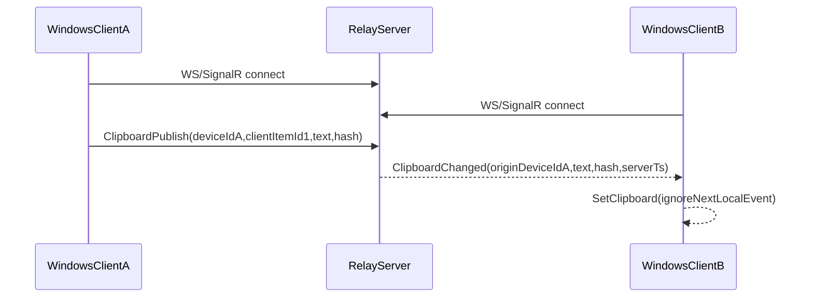

# Core-First Clipboard Sync (Windows MVP) Plan

## What changes vs prior plan

- **Phase order**: (1) core real-time sync → (2) authentication → (3) encryption + persistence.
- **Core phase has no accounts** and uses a **single global sync group** (fastest to validate end-to-end behavior).
- **Protocol goal**: low-latency, minimal overhead (binary framing / MessagePack).

## Target for Phase 1 (Core Sync)

- **Platforms**: Windows ↔ Windows (two PCs or two instances).
- **Clipboard types**: text only.
- **Sync model**: server broadcasts latest clipboard item to all connected clients.
- **No auth, no encryption, no DB** (ephemeral relay only).

## Recommended Stack (easy now, good long-run)

- **Relay server**: .NET 8 **ASP.NET Core** with **SignalR using MessagePack protocol** (efficient binary over WebSockets + built-in reconnect).
- **Windows client**: .NET 8 **WPF tray app** (best Windows clipboard integration; small UI footprint).

Why this choice:

- SignalR+MessagePack is **lightweight enough** for clipboard payloads, and avoids hand-rolling reconnect/heartbeat logic.
- WPF gives the most predictable clipboard APIs on Windows; later we can swap UI to WinUI/Avalonia if desired without changing the protocol much.

## Core Protocol (Phase 1)

**Client → Server**: `ClipboardPublish`

- `deviceId` (GUID)
- `clientItemId` (GUID)
- `tsClient` (UTC ms)
- `text` (string)
- `textHash` (SHA-256 or fast hash; used for loop prevention)

**Server → Clients**: `ClipboardChanged`

- `originDeviceId`
- `serverTs`
- `text`
- `textHash`

Loop prevention rules:

- Ignore `ClipboardChanged` where `originDeviceId == deviceId`.
- When client sets clipboard due to remote update, enable a short-lived `ignoreLocalClipboardEvent` guard.
- Debounce rapid local changes (e.g., 150–300ms).

## Architecture

## Phases

### Phase 1 — Core sync (no auth/encryption)

- Relay server:
  - SignalR hub with `ClipboardPublish`
  - Broadcast `ClipboardChanged`
  - Basic limits: max text size (e.g., 64KB)
- Windows tray client:
  - Clipboard watcher (text only)
  - SignalR client connect/reconnect
  - Send local changes; apply remote changes with loop guard
  - Minimal settings: server URL + device name

### Phase 2 — Authentication (after core works)

- Add `POST /auth/register` + `POST /auth/login` and JWT.
- Require auth for hub connection.
- Introduce per-user “groups” (replaces single global group).

### Phase 3 — Encryption + persistence

- Encrypt-at-rest for clipboard items in DB (AES-GCM with server secret) **or** E2EE upgrade later.
- Add DB (SQLite→Postgres ready) and retention policy (e.g., last N items).

## Acceptance Criteria (Phase 1)

- Two Windows clients connected to the same server reflect clipboard text changes in near real-time.
- No infinite loops when applying remote clipboard updates.
- Reconnect resumes syncing automatically after brief network loss.

## Files we’ll create once you approve execution

- `server/RelayServer/Program.cs`
- `server/RelayServer/Hubs/ClipboardHub.cs`
- `server/RelayServer/Protocols/ClipboardMessages.cs`
- `windows/ClipboardSync.App/*` (tray app + watcher + SignalR client)