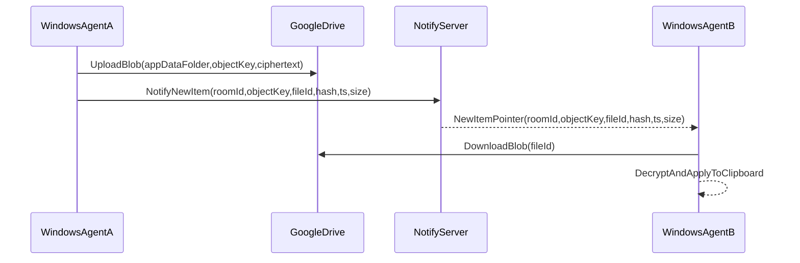

# Drive-Backed Clipboard Sync (Server Has No Payload)

## Goal

Build a fast clipboard sync where **clipboard payload never reaches our server**. The server is used only for **real-time notifications** and device coordination. Clipboard content is stored in a location under the user’s control: **Google Drive**.

## Key design choices

- **Storage**: Google Drive `appDataFolder` (hidden app storage, no clutter).
- **Notification**: keep our current server as a **SignalR notification hub**, but broadcast only **pointers/metadata** (no clipboard text).
- **Security**:
  - Server sees **metadata only** (fileId/objectKey, sizes, timestamps, deviceId).
  - Recommended: **client-side encryption before upload** so even Google Drive stores ciphertext.
- **Identity/auth**:
  - Use Google OAuth on each client to access Drive.
  - Tokens should be stored **locally** (Windows DPAPI, Android Keystore later). Server does **not** need Drive tokens.
  - For the notification server, MVP can avoid accounts by using a **roomId/roomSecret** (pairing code) to prevent unrelated clients from receiving pointers.

## Data flow (fast path)

Why this stays low-latency:

- The server push is immediate.
- The only extra step vs relay-payload is a small Drive download (usually fast for text).

## Protocol changes (server payload removed)

Create new MessagePack DTOs (shared) for pointer-only notifications, e.g.

- `NewClipboardPointer(roomId, originDeviceId, objectKey, fileId, tsUtcMs, contentHash, sizeBytes, contentType)`
- Optional: `AckPointer(roomId, pointerId)`

## Google Drive storage format

- Folder: `appDataFolder`
- Object naming: `clips/<roomId>/<tsUtcMs>_<originDeviceId>_<hash>.bin`
- Retention: keep last N objects per room (client-side cleanup first; server doesn’t store).

## Client-side encryption (recommended)

- Encrypt before upload using **AES-GCM**.
- Keying options:
  - MVP: user enters a **shared passphrase** on both devices → derive key via PBKDF2/Argon2.
  - Later: QR-based pairing to exchange a random key.
- Store derived key material locally; never send it to server.

## Implementation phases

### Phase 1 — Drive-backed pointer sync (Windows only)

- Add Google OAuth sign-in and Drive upload/download to Windows agent.
- Add pointer-only hub methods on server + shared DTOs.
- Implement one-PC testing with Windows Sandbox.

### Phase 2 — Hardening

- Retry logic for Drive upload/download.
- Conflict policy (last-write-wins by timestamp).
- Throttling/debounce.

### Phase 3 — Optional: encryption + retention

- Add AES-GCM envelope format and key management.
- Add cleanup policy (keep last N / last X days).

## Testing strategy

- Unit tests:
  - Encryption/decryption roundtrip (if enabled)
  - Pointer DTO serialization
- Integration tests:
  - Notification server: broadcasts pointers, latest pointer on connect, reconnect behavior
  - Drive client: use a mockable interface; for live Drive tests keep them manual (requires credentials)
- E2E:
  - Windows host + Windows Sandbox (separate clipboards)

## Files likely to change/add

- Server:
  - [`server/RelayServer/Hubs/ClipboardHub.cs`](server/RelayServer/Hubs/ClipboardHub.cs) (replace payload broadcast with pointer broadcast)
  - Add a minimal room/group mechanism
- Shared:
  - [`shared/ClipboardSync.Protocol/ClipboardMessages.cs`](shared/ClipboardSync.Protocol/ClipboardMessages.cs) (add pointer DTOs)
- Windows client:
  - [`clients/ClipboardSync.WindowsAgent/Sync`](clients/ClipboardSync.WindowsAgent/Sync) (Drive upload/download + notify)
  - Settings: add roomId/secret, Google auth state, optional encryption passphrase