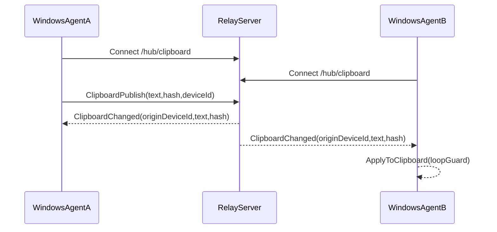
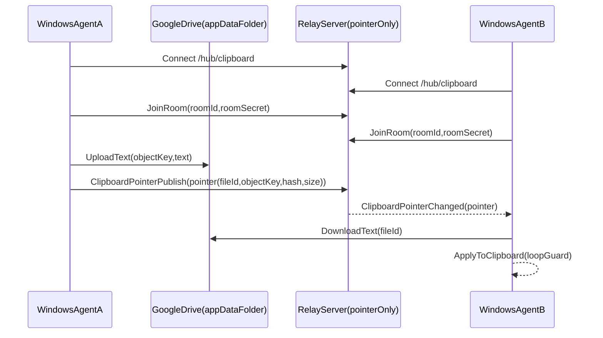

# ClipboardSync — Logical flow (pictorial)

This document shows the **high-level flow** of ClipboardSync in both variants.

## Common client loop (Windows agent)

```mermaid
flowchart TD
  clipboard[WindowsClipboard] --> watcher[ClipboardWatcherOrPoller]
  watcher -->|TextChanged| loopGuard[ClipboardLoopGuard]
  loopGuard --> decision{PublishEnabled?}
  decision -->|No| stop1[NoOp]
  decision -->|Yes| mode{SyncMode}
  mode -->|Relay| relayPublish[SignalR: ClipboardPublish(Text)]
  mode -->|Drive| driveUpload[DriveUpload(Text)]
  driveUpload --> pointerPublish[SignalR: ClipboardPointerPublish(Pointer)]

  relayRecv[SignalR: ClipboardChanged] --> apply1[ApplyToClipboard]
  pointerRecv[SignalR: ClipboardPointerChanged] --> driveDownload[DriveDownload(FileId)]
  driveDownload --> apply2[ApplyToClipboard]
```

## Relay mode (server relays payload)



## Drive mode (server relays pointers only)



## Server-side scoping (rooms)

```mermaid
flowchart TD
  conn[SignalRConnection] --> join[JoinRoom(roomId,secret)]
  join --> validate[ValidateOrCreateRoom(secretHash)]
  validate --> group[AddToSignalRGroup(roomId)]
  group --> latest[SendLatestPointerToCallerIfAny]
  publish[ClipboardPointerPublish(pointer)] --> check[EnsureJoinedRoomAndRoomMatch]
  check --> store[UpdateLatestPointer(roomId)]
  store --> broadcast[BroadcastToGroup(roomId)]
```


